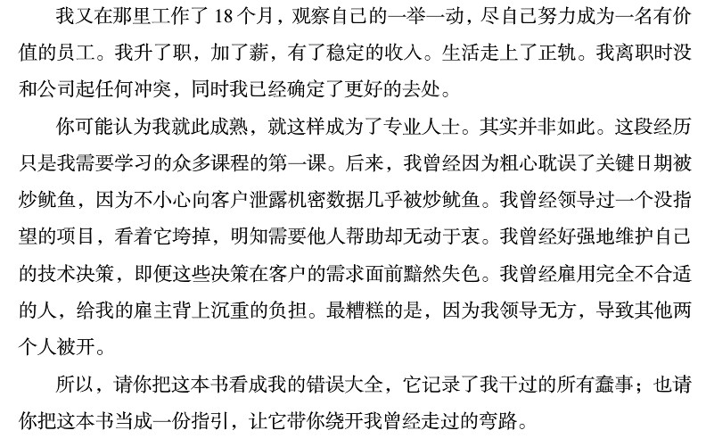

6年前看的书，重新整理一下

### 前言

### 摘要

#### 一 (专业主义)
1. 专业主义的精髓就在于将公司的利益视同个人的利益。(这个呢，看情况吧)
2. 不能忽略完整的测试环节，否则就交付软件是不负责任的。
3. 为自己的不完美负责。代码难免出现bug，但这并不意味着你不用对它们负责。
4. 让QA找不出任何问题。把自己没把握的代码发送给QA是不专业的，违背了“不行损害之事”的原则。
5. 有些代码很难测试，是因为设计时就没考虑如何测试。唯一的解决办法就是要设计易于测试的代码，最好事先写测试，再写要测的代码。(前半句挺对，后半句实际上比较难操作？)
6. 职业发展是你自己的事。雇主没有义务确保你在职场能够立于不败之地。
	- 雇主出了钱，你必须付出时间和精力。一周工作60个小时，前40小时给雇主，后20小时是给自己的。你应该看书，练习，学习，做一些提升职业能力的事情。
	- 每天大概是3个小时是给自己提升的，你可以在路上学习，在公交学习等，利用一些时间碎片。
	- 一周有168小时，给你雇主40小时，为自己的职业发展留20小时，剩下的108小时再留56小时给睡眠，那么还剩52小时可做其他的事。
	- 其实这样让你免于枯竭匮乏，假设你热爱软件开发，渴望成为专业开发者，在那20个小时里，就应该做能够激发，强化你的热情的事，那20小时是充满乐趣！
7. IT行业发展迅猛，要时常了解自己的领域，坚持广泛学习才不至于落伍，但并不意味着忘掉过去。别忘了桑塔亚纳的诅咒：“不能铭记过去的人，注定重蹈先人的覆辙”。
8. 每个软件开发人员必须精通的事项：
<pre>
设计模式。GOF书中的全部24种模式。
设计原则。必须了解SOLID原则，而且深刻了解组件设计原则。
方法。必须理解XP，Scrum，精益，看板，瀑布，结构化分析及结构化设计等。
实践。必须掌握测试驱动开发，面向对象设计，结构化编程，持续集成和结对编程。
工件。必须了解如何使用UML图，DFD图，结构图，Petri网络图，状态迁移图表，流程图和决策表。
</pre>
9. ---
	- 练习。业精于勤，真正专业人士往往勤学苦干，以求得自身技能的纯属精炼。
	- 合作。学习的第二个最佳方法就是与他人合作。从彼此身上学到很多东西，而且能在更短的时间内更高质量地完成更多工作。并不是要花全部时间一直和别人共事，独处的时间也更重要。
	- 辅导。教学相长，想迅速牢固地掌握某些事实和观念，最好的方法就是与由你负责的人交流这些内容。传道授业中，导师也会从中受益。
10. 了解业务领域。了解自己所开发项目的业务领域，了解该领域的基本架构和基本知识，一边同客户和用户访谈。花时间与业内专家交流，了解他们的原则和价值观念。
11. 雇主的问题就是你的问题。弄明白这些问题，并寻求最佳解决方案。开发系统时，站在雇主的角度思考，确保开发的功能真正满足雇主的需要。

#### 二 (说“不”)
1. 许诺“尝试”，就意味着你承认自己之前未尽全力，承认自己还有余力可施。
只要你许诺会去“尝试”，你其实是在承诺你会确保成功。
从本质上讲，承诺“尝试”就是一种不诚实的表现。你这么做的原因，可能是为了护住面子和避免冲突。
2. 坚守专业主义精神，不能为了赶工而写出糟糕的代码，如果不能做到，当初就应该说“不”。
(这个吧，尽量吧，前提老板是个讲道理的人。。。。)

#### 三 (说“是”)
1. 口头上说。心里认真。付诸行动。
做出承诺，包含三个步骤。
1口头上说自己将会去做。
2心里认真对待做出的承诺。
3真正付诸行动。

2. 没有做到自己对他人之前的承诺，会让自己难堪。言必信，行必果。
你只能承诺自己能完全控制的事。
如果你不尽早告诉别人可能的问题，就错失了让他们帮助你达成目标，兑现承诺的机会。
(前提是老板要讲道理啊。。。)
3. 若为了赶工完成任务，周六日加班，那么要求周三才上班也是应该的。 (现实情况。。。)

#### 四 (编码)
1. 编码是一项颇具挑战也十分累人的智力活动。相比其他，编码要求更加聚精会神。
自己的代码要让其他人看得懂。(将心比心啊！)
2. 如果感到疲劳或者心烦意乱，千万不要编码。
奉献精神和职业素养，更多意义上指要遵循纪律原则而非成为长时间工作的工作狂。
要确保自己已经将睡眠，健康和生活方式调整到最佳状况，这样才能做到每天的8个小时工作时间内全力以赴。 (虽然生活欺骗了你，但自己也别自暴自弃。。。。)
3. 中断无法避免，总有人会打断你，消耗你的时间。发生这种情况时要记住一点，也许下次也会轮到你去打断别人请求帮助。因此，礼貌地表现出乐于助人的态度才是专业的态度。(还是将心比心！)
4. 当大脑已经无法正常思考却硬逼自己在深夜还加班解决问题，你只会把自己折腾得更累，回家洗澡之类的反而会豁然开朗。
当碰到困难而受阻时，当你感到疲倦时，就离开一会儿，让富有创造力的潜意识接管问题。
精力分配得当，你将能在更短的时间内以更少的精力完成更多的事情。让自己保持好节奏，让团队保持好节奏。
了解你的创造力和智力运行的模式，充分发挥它们的优势而非与之背道而驰。
埋头忙于解决问题时，有时候可能会由于和问题贴得太近，无法看清楚所有的可选项。由于大脑中富有创造力的部分被紧张的专注力所抑制，你会错过漂亮的解决方案。
(适当放松一下，欲速则不达！！)
5. 互相帮助是每个程序员的职责所在。作为专业人士，要以随时帮助别人为荣。
当然你需要独处时间，你可以直接并礼貌的告诉别人你在某个时间段不希望被人打扰。
(自重感啊)
6. 接受他人的帮助。如果有人向你伸出援手，要诚挚接受，心怀感激地接受帮助并诚意合作。
不要因为自己进度压力很大，就推开伸来的援手。不妨给他半个小时的时间。如果到时那个人不能真正帮到你，再礼貌地致歉用感谢结束谈话也不迟。要记住，如同要以乐于助人为荣一样，也要以乐于接受别人的帮助为荣。
要学会如何求助。如果帮助唾手可得却让自己一个人堵在那儿，是很不专业的表现。
(透明透明！不盲目埋头苦干！)
7. 辅导缺乏经验的程序员是那些经验丰富的程序员的职责。向资深导师寻求辅导也是年轻程序员的专业职责。(大家都那么菜，别不好意思！)

#### 六 (练习)
1. 保持不落伍的一种方法是为开源项目贡献代码。
2. 职业程序员是用自己的时间来练习。老板的职责不包括避免你的技术落伍，也不包括为你打造一份好看的履历。
既然你是用自己的时间练习，就不必限制在老板规定的语言和平台。可以选择你喜欢的语言，练习你喜欢的技术。
(要多多学习啊！)

#### 九 (时间管理)
1. 受到邀请的会议没有必要全部参加。参加的会议太多，其实只能证明你不够专业。理智使用时间，谨慎选择，礼貌拒绝。
邀请你参加会议的人并不负责管理你的时间，为时间负责的只有你。
领导最重要的责任之一，就是帮你从某些会议脱身。好的领导一定会主动维护你拒绝出席的决定，因为他和你一样关心你的时间。
(时间宝贵，无效浪费还不如用来睡觉。。。)
2. 如果会议让人厌烦，就离席。如果你发现参加某个会议是在浪费时间，就应当想个礼貌的方法退出来。
重要的是，你应当明白，继续呆在会议室里是浪费时间；继续参加对你没有太多意义的会议，是不专业的行为。
3. 如果受到会议邀请，务必弄清楚指定的议题是什么，每个议题花多长时间没要取得什么成果。如果得不到确切的答案，你可以礼貌拒绝。
4. 专业开发人员会安排好他们的睡眠，保证清晨有饱满的注意力去上班。
5. 运动需要肌肉的注意力，而编程需要的是心智的注意力。肌肉注意力有助于改善心智注意力。
6. 时间拆分与番茄工作法。
7. 专业开发人员会评估每个任务的优先级，排除个人喜好和需要，按照真实的紧急程度来执行任务
8. 选择了走不通的技术道路，你对这个决定越是坚持，浪费时间就越多。
专业开发人员不会执拗于某个不容放弃的主意，他们会保持开放的头脑来听取其他意见，让自己有多种选择，一旦看清楚，就会避开。

#### 十(预估)
1. 专业开发人员能够清楚区分预估和承诺。只有在确切知道可以完成的前提下，他们才会给出承诺。而且会尽可能清楚说明预估的概率分布，这样主管就可以做出合适的计划。
2. 大多数情况下，专业人士都不会给出确切的承诺，而是提供概率预估，来描述期望完成时间及可能的变数。

#### 十一(压力)
1. 即使有压力，专业人士也会冷静果断。尽管压力不断增大，他仍然会坚守所受的训练和纪律，他知道这些是他赖以战胜有最后期限和承诺所带来的压力感的最好方法。
2. 快速前进确保最后期限的方法，便是保持整洁。专业人士不会为了快点前进而乱来。脏乱只会导致缓慢。
3. 观察自己在危机时刻的反应，就可以了解自己的信念。如果在危机中依然遵循着你守持的纪律，就说明你确信这些纪律。
如果在平常时候你会注意保持代码整洁，但在危机时刻你却产出混乱的代码，就说明你并不真正相信混乱会导致速度下降。
如果你遵守的纪律原则是工作的最佳方式，那么即使是深度危机中，也要坚决秉持这些纪律原则。

#### 十二(协作)
1. 专业程序员最糟糕的表现就是两耳不闻窗外事，只顾一头将自己埋在技术堆里，甚至连公司业务火烧眉毛行将崩溃了也不闻不问。
你的工作职责就是要让业务免于陷入困顿，让公司可以长久发展下去。
专业程序员会花时间去理解业务。他们会和用户讨论他们正在使用的软件，会和销售人员与市场人员讨论所遭遇的问题，会和经理们沟通，明确团队的短期目标和长期目标。

2. 不正常的团队最糟糕的症状是，每个程序员在自己代码周边筑起一道高墙，拒绝让其他程序员接触到这些代码。
这样会造成许多重复代码，模块间的接口完全是杂乱混淆而非正交的。
将代码所有权的各种隔断全部打破，由整个团队共同拥有全部代码的做法，相较于此要好得多。
专业开发人员不会阻止别人修改代码的。他们通过合作来达到学习的目的。

#### 十四(辅导、学徒期与技艺)
1. 计算机科班毕业生的质量一直令我颇感失望。究其原因，并不是这些毕业生不够聪明或缺乏天份，而是由于大学并没有教授真正的编程之道。
2. 我们今天的做法和我所提倡的理想化的学徒制程序，这两者之间的主要差异在于技术方面的传授，培训，督导和检查。
观念上最大差别在于，专业主义价值观和技术敏锐度需要进行不断的传授，培育，滋养和文火慢炖，直至其深植入文化当中。
我们当前的做法之所以传承无力， 主要是因为其中缺少了资深人士辅导新人向其传授技艺的环节。

---

### 附录
<pre>
编辑推荐

编程大师Bob大叔40年编程生涯心得体会
讲解成为真正专业程序员所需态度原则
业界权威好评，广受赞誉
助您职业生涯迈上更高台阶

媒体推荐

Bob大叔的这本新作又一次抬高了专业程序员的门槛，指出了他们需要在历练尚浅的软件开发职业生涯中需要不断精进的内容。
——Markus Gartner,it-agile公司资深软件开发者

有一些技术书颇具启发与教益，有一些则读来轻松喜悦且富有趣味，但很少有技术书籍能够同时兼具所有这四个特色。我感觉Martin所有的书都可归入此列。
——George Bullock，微软公司资深程序经理

如果计算机科学学位要求有“毕业后必读书单”，本书当在其列。本书描述了迈向专业程序员的修炼旅程……而且阅读起来确实异常有趣。
——Jeff Overvey，伊利诺伊大学厄本那-香槟分校

如果你期望自己能成为软件专业人士，那么本书不容错过。
——R.L.Bogetti,Baxter Healthcare公司系统主设计师

作者简介

Robert C.Martin
世界级软件开发大师，设计模式和敏捷开发先驱，敏捷联盟首任主席，C++ Report前主编，背后辈程序员尊称为“Bob大叔”。20世纪70年代初成为职业程序员，后创办Object Mentor公司并任总裁。Martin还是一名多产的作家，至今已发表数百篇文章、论文和博客，除本书外，还著有《代码整洁之道》、《敏捷软件开发：原则、模式和实践》、《UML：Java程序员指南》等。他最近创办了cleancoders.com网站，专为软件开发人员提供教育视频。

目录

目　录

第1章　专业主义　1
1.1　清楚你要什么　2
1.2　担当责任　2
1.3　首先，不行损害之事　4
1.3.1　不要破坏软件功能　4
1.3.2　不要破坏结构　7
1.4　职业道德　8
1.4.1　了解你的领域　10
1.4.2　坚持学习　11
1.4.3　练习　11
1.4.4　合作　12
1.4.5　辅导　12
1.4.6　了解业务领域　13
1.4.7　与雇主/客户保持一致　13
1.4.8　谦逊　13
1.5　参考文献　14

第2章　说“不”　15
2.1　对抗角色　17
2.2　高风险时刻　20
2.3　要有团队精神　22
2.3.1　试试看　24
2.3.2　消极对抗　25
2.4　说“是”的成本　27
2.5　如何写出好代码　34

第3章　说“是”　37
3.1　承诺用语　39
3.1.1　识别“缺乏承诺”的征兆　40
3.1.2　真正的承诺听起来是怎样的　41
3.1.3　总结　43
3.2　学习如何说“是”　43
3.2.1　“试试”的另一面　43
3.2.2　坚守原则　44
3.3　结论　47

第4章　编码　48
4.1　做好准备　49
4.1.1　凌晨3点写出的代码　50
4.1.2　焦虑时写下的代码　51
4.2　流态区　53
4.2.1　音乐　54
4.2.2　中断　55
4.3　阻塞　55
4.4　调试　57
4.5　保持节奏　60
4.5.1　知道何时应该离开一会　60
4.5.2　开车回家路上　61
4.5.3　洗澡　61
4.6　进度延迟　61
4.6.1　期望　62
4.6.2　盲目冲刺　62
4.6.3　加班加点　63
4.6.4　交付失误　63
4.6.5　定义“完成”　64
4.7　帮助　64
4.7.1　帮助他人　64
4.7.2　接受他人的帮助　65
4.7.3　辅导　66
4.8　参考文献　66

第5章　测试驱动开发　67
5.1　此事已有定论　69
5.2　TDD的三项法则　69
5.3　TDD的优势　70
5.3.1　确定性　70
5.3.2　缺陷注入率　71
5.3.3　勇气　71
5.3.4　文档　72
5.3.5　设计　72
5.3.6　专业人士的选择　73
5.4　TDD的局限　73
5.5　参考文献　74

第6章　练习　75
6.1　引子　75
6.1.1　10的22次方　76
6.1.2　转变　77
6.2　编程柔道场　79
6.2.1　卡塔　80
6.2.2　瓦萨　81
6.2.3　自由练习　81
6.3　自身经验的拓展　82
6.3.1　开源　82
6.3.2　关于练习的职业道德　82
6.4　结论　83
6.5　参考文献　83

第7章　验收测试　84
7.1　需求的沟通　84
7.1.1　过早精细化　86
7.1.2　迟来的模糊性　87
7.2　验收测试　89
7.2.1　“完成”的定义　89
7.2.2　沟通　91
7.2.3　自动化　92
7.2.4　额外工作　93
7.2.5　验收测试什么时候写，由谁来写　93
7.2.6　开发人员的角色　94
7.2.7　测试的协商与被动推进　95
7.2.8　验收测试和单元测试　96
7.2.9　图形界面及其他复杂因素　97
7.2.10　持续集成　98
7.3　结论　98

第8章　测试策略　99
8.1　QA应该找不到任何错误　100
8.1.1　QA也是团队的一部分　100
8.1.2　需求规约定义者　100
8.1.3　特性描述者　100
8.2　自动化测试金字塔　101
8.2.1　单元测试　101
8.2.2　组件测试　102
8.2.3　集成测试　103
8.2.4　系统测试　104
8.2.5　人工探索式测试　104
8.3　结论　105
8.4　参考文献　105

第9章　时间管理　106
9.1　会议　107
9.1.1　拒绝　107
9.1.2　离席　108
9.1.3　确定议程与目标　109
9.1.4　立会　109
9.1.5　迭代计划会议　109
9.1.6　迭代回顾和DEMO展示　110
9.1.7　争论/反对　110
9.2　注意力点数　111
9.2.1　睡眠　112
9.2.2　咖啡因　112
9.2.3　恢复　112
9.2.4　肌肉注意力　112
9.2.5　输入与输出　113
9.3　时间拆分和番茄工作法　113
9.4　要避免的行为　114
9.5　死胡同　115
9.6　泥潭　115
9.7　结论　116

第10章　预估　117
10.1　什么是预估　119
10.1.1　承诺　119
10.1.2　预估　120
10.1.3　暗示性承诺　121
10.2　PERT　122
10.3　预估任务　125
10.4　大数定律　127
10.5　结论　127
10.6　参考文献　128

第11章　压力　129
11.1　避免压力　131
11.1.1　承诺　131
11.1.2　保持整洁　132
11.1.3　危机中的纪律　132
11.2　应对压力　133
11.2.1　不要惊慌失措　133
11.2.2　沟通　133
11.2.3　依靠你的纪律原则　133
11.2.4　寻求帮助　134
11.3　结论　134

第12章　协作　135
12.1　程序员与人　137
12.1.1　程序员与雇主　137
12.1.2　程序员与程序员　140
12.2　小脑　142
12.3　结论　143

第13章　团队与项目　144
13.1　只是简单混合吗　144
13.1.1　有凝聚力的团队　145
13.1.2　如何管理有凝聚力的团队　146
13.1.3　项目承包人的困境　147
13.2　结论　148
13.3　参考文献　148

第14章　辅导、学徒期与技艺　149
14.1　失败的学位教育　149
14.2　辅导　150
14.2.1　DIGI-COMP I, 我的第一台计算机　150
14.2.2　高中时代的ECP-18　152
14.2.3　非常规辅导　154
14.2.4　艰难的锤炼　155
14.3　学徒期　156
14.3.1　软件学徒期　158
14.3.2　现实情况　159
14.4　技艺　160
14.5　结论　161

附录　工具　162
</pre>

